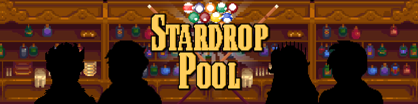
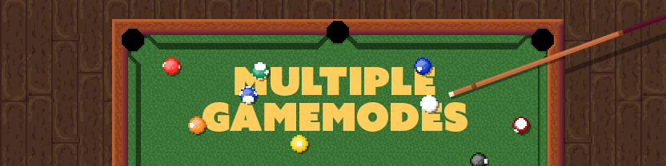
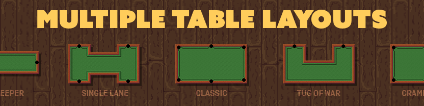

  

  Look forward to Friday nights at the saloon!

  <a href="#">Demo</a>
  ·
  <a href="#">Download</a>
  ·
  <a href="#">Issues</a>

# Stardew Valley Mod: Stardrop Pool Minigame

Turns the pool table into the saloon into a fully functional minigame! Just right click on the pool table in the saloon to get started.

Play a multiplayer friend, or challenge Sam and Sebastian to a game! Who knows, if you win, some more opponents might come to challenge you.

Become the champion, amass collectables, experiement with new table layouts and gamemodes. Look forward to your Friday nights at the saloon.

# Table of Contents

- [Gamemodes](#gamemodes-banner)
- [Table Layouts](#table-layouts-banner)

&nbsp;
&nbsp;
&nbsp;

  

  Stardrop Saloon features a variety of gamemodes with more to come.

# Gamemodes

## 8-Ball

Players are either stripes or solids. First to pocket all seven of their ball and then the 8-ball last wins. The most frequently played and well known pool billiards. [Find more info here.](https://en.wikipedia.org/wiki/Eight-ball)

## 9-Ball

First to pocket the 9-ball wins. Legal shots must hit the lowest ball first. [Find more info here.](https://en.wikipedia.org/wiki/Nine-ball)

## Goalkeeper

Stardrop Pool Original. Both players have their own cue balls and designated pockets to protect, and to score in, like soccer (football). Balance offence and defense for the most success. The player with the most points when all balls are pocketed wins.

## Tug of War

Stardrop Pool Original. Both players have designated pockets to protect, and to score in, like soccer (football). However, unlike [Goalkeeper](#goalkeeper), both players share the same cue ball. There are fewer balls and both players must battle over positioning to win. Games are limited by the number of balls and the number of turns taken.

## Chaos

Stardrop Pool Original. Balls do not obey traditional laws of physics. The first person to grow comfortable with the uncomfortable wins. The game is won by the person with the most balls pocketed.

&nbsp;
&nbsp;
&nbsp;

  

  Stardrop Pool allows you to pick from selection of strange tables.

# Table Layouts

## Classic

Your classic pool table. Four walls, six pockets, and fierce competition.

## Tug of War

Named after the gamemode it best suites. Battle against your opponent for positioning as you attempt to score points in your opponents pocket, while defending your own.

## Crammed

Four small walls. Chaos and unintentional bounces are bound to happen.

## Goalkeeper

Named after the gamemode it best suites. Battle against your opponent and score points in their pocket, while defending your own. Each player is given their own cue ball.

## Single Lane

Single lane features a claustrophobic cooridor which will limit your available shots and force you to go for bank shots.

